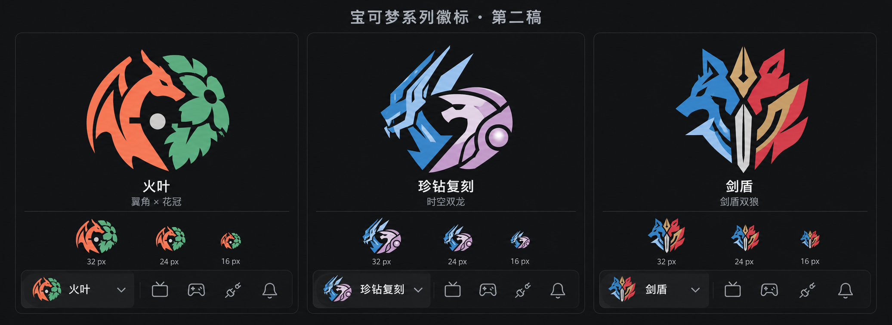

# 宝可梦游戏切换徽标设计预览

2026-10-07：第二稿获确认后，已根据该方向手工整理为透明 SVG 并接入渲染层。顶部、游戏选择菜单和收起侧栏共用 `GameEmblem`。第二稿概念预览使用内置 ImageGen 生成；第一稿只完成精灵素材替换与排版，用户指出这不构成独立标识设计，因此第二稿改为提炼角色轮廓、组合构图与负形。第一稿保留于 [原始预览](design/game-selector-identity-v1.png)，不再作为当前设计方向。

第二稿中的大图、尺寸对照和工具栏均为放大示意，图内的 16／24／32px 标签不能作为实际像素测试证据。正式 SVG 已减少内部结构，统一为平涂，实际尺寸验证见下文。应用使用本地 SVG，生成预览不作为运行时素材。

## 视觉方向

以对应作品的封面宝可梦为识别基础，将其特征提炼成可独立使用的系列徽标，替换现有纯色色块。保留游戏名称和游戏切换交互。顶部继续只有视频源、手柄工具、按上次重连、通知四个工具按钮，保持单行。

| 系列 | 识别来源 | 构图方向 |
| --- | --- | --- |
| 火红／叶绿 | 喷火龙／妙蛙花 | 翼角与花冠形成红绿双侧轮廓，围绕中心负形连接 |
| 晶灿钻石／明亮珍珠 | 帝牙卢卡／帕路奇亚 | 尖锐头冠与圆弧装甲形成蓝紫双龙组合 |
| 剑／盾 | 苍响／藏玛然特 | 双狼头部轮廓与剑刃、盾鬃合成一个紧凑符号 |

三个徽标采用相近的视觉尺寸、轮廓粗细、负形留白和克制的双色配色，以轮廓及配色区分作品。顶部与游戏选择菜单复用对应系列徽标，表示系列切换；具体存档版本仍由存档区域表达。菜单中的选中态只对应当前游戏系列。

## 正式实现

素材位于 `src/assets/game-emblems/`，三组均使用 64 × 64 viewBox、透明背景和固定平涂色。`*-compact.svg` 用于顶部 16px 槽位，省略眼部、翼内与装甲细线；普通版用于菜单和收起侧栏的 24px 槽位。火叶保留翼角、花冠和中心负形，珍钻保留双龙头冠与平涂珍珠，剑盾保留双狼、剑刃和盾鬃。

`src/components/GameEmblem.tsx` 根据游戏系列与紧凑模式选择素材。徽标作为装饰隐藏于辅助技术，父按钮保留原有中文名称。顶部按钮内部间距从 7px 调整为 4px，以在原有侧栏宽度内容纳 16px 徽标；四个工具按钮及单行布局保持原有尺寸。

### 验证记录

- `npm run build` 通过；`npm exec vitest run src/App.test.tsx -- --maxWorkers=1` 的 23 项现有测试通过。
- Browser 插件未提供，使用捆绑 Playwright 的 Electron API，在独立测试配置中验证实际构建资源；未使用用户存档目录。
- 在 Windows 100%、系统原生 150%、强制 200% 缩放下，三组徽标与两种变体均加载成功；顶部 16px，菜单与收起侧栏 24px。
- 三个游戏系列切换及选中态、侧栏展开／收起、方向键与 End／Enter、Esc 关闭菜单、最小内容尺寸 1100 × 680、现有手柄工具菜单通过。
- 渲染边界检查确认四个工具按钮与游戏选择同排、无重叠，游戏名称完整；实际截图已人工检查，无相关渲染错误。
- 另在实际浏览器视口中检查了 16／24／32px 素材对照；该对照使用正式 SVG，而非概念图的缩小示意。

## 本次生成提示摘要

以第一稿界面和已有帝牙卢卡／帕路奇亚图像为参考，重新构建三个独立系列徽标。将喷火龙的翼角与妙蛙花的花冠、帝牙卢卡与帕路奇亚的头冠轮廓、苍响与藏玛然特的狼头及剑盾特征合成符号；统一视觉重量、双色配色与负形留白，避免整只精灵贴图。生成并排的大图、缩小示意和单行工具栏，沿用当前深色界面与中文名称。
