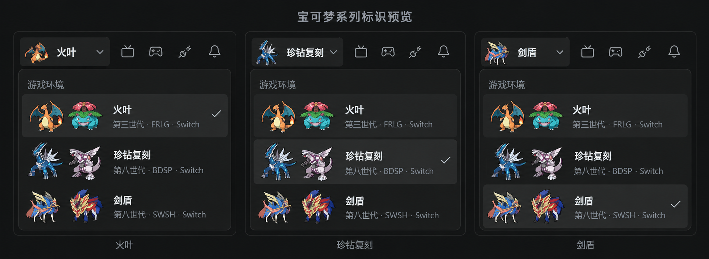

# 宝可梦游戏切换标识预览

2026-10-07：使用内置 ImageGen，参考当前应用截图生成的放大概念预览。此提交保存设计方向，尚未接入渲染层。生成图用于确认角色与布局，不作为最终图标源文件；角色细节、选中态与实际尺寸以正式实现为准。

## 视觉方向

左上角使用对应宝可梦作品的封面角色图标，替换现有纯色色块，保留游戏名称和游戏切换交互。顶部继续只有视频源、手柄工具、按上次重连、通知四个工具按钮，保持单行。

| 系列 | 双版本角色 |
| --- | --- |
| 火红／叶绿 | 喷火龙／妙蛙花 |
| 晶灿钻石／明亮珍珠 | 帝牙卢卡／帕路奇亚 |
| 剑／盾 | 苍响／藏玛然特 |

顶部使用单只小图标，游戏选择菜单显示该系列的双版本组合。当前存档有明确版本时，顶部可使用对应角色；尚无存档版本信息的系列使用固定代表角色。菜单中的选中态只对应当前游戏系列。

## 实现步骤

1. 准备六只角色的独立透明图标，保留素材来源说明。项目已有帝牙卢卡与帕路奇亚 PNG，其余角色需补齐。生成预览不代表这些素材已补齐。
2. 新增共用的游戏标识组件，供顶部、切换菜单和收起侧栏使用。顶部图标约 16px，菜单单只角色约 20–24px；使用固定占位与留白，避免图片尺寸影响布局。保留实际宝可梦轮廓，不用名称对应的抽象几何图形替代。
3. 在现有侧栏宽度内调整选择按钮的内部间距，保持四个工具按钮的大小与单行排列；下拉菜单按双角色图标所需空间适当调整。
4. 接入当前游戏与可用的存档版本信息。保留现有中文名称、键盘切换、状态点与手柄工具菜单。
5. 在实际 Electron 窗口验证三个游戏系列、六只角色、侧栏展开／收起、最小窗口和 Windows 缩放，重点检查小图标辨识度、文字裁切与菜单选中态。

## 本次生成提示摘要

以当前应用截图和已有帝牙卢卡／帕路奇亚图像为参考，生成三个并排放大的左上角 UI 预览，分别选择火叶、珍钻复刻和剑盾；顶部保留单行四个工具图标，游戏菜单使用六只封面宝可梦的双版本组合，沿用当前深色界面与中文名称。
